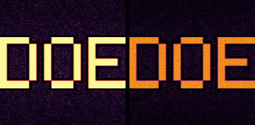
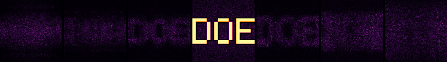
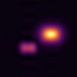

# DiffractiveOpticalElement

Design a diffractive optical element (DOE) and then **actually project with it**.

This is a physical-optics toolkit in plain JavaScript: complex fields, FFTs, angular-spectrum and
Fresnel propagation, phase retrieval (Gerchberg–Saxton and friends), holographic recording and
reconstruction, an end-to-end projector pipeline, and a browser workbench to watch it happen.
No build step, no dependencies, no Python — `node` and a browser are all you need.

```bash
node --test "test/*.test.js"     # 71 tests: unitarity, Parseval, oracles, projection quality
node tools/bench.mjs             # throughput + fidelity numbers
node tools/render-demo.mjs       # writes the figures in docs/img
node server.mjs                  # the workbench at http://localhost:5173
```

```js
import { ProjectorSystem } from './src/index.js';

const sys = new ProjectorSystem({
  n: 256, pitch: 8e-6, lambda: 532e-9, distance: 30e-3,
  mode: 'image-plane',
  target: { kind: 'text', text: 'DOE' },
});

sys.design();                       // phase retrieval against the full optical model
const field = sys.simulate();       // complex field at the screen
const m = sys.screenMetrics(field); // rmse, correlation, efficiency, ssim, zero-order…
console.log(m.rmse, m.efficiency);  // 0.0064  0.78
```



*Left: an image-plane head projecting the word DOE at its design distance (RMSE 0.6 %, 78 % of the
incident light in the image). Right: the same target through a Fourier-type head (RMSE 8.2 %).*

---

## What "true projection" means here

A decorative diffraction picture and a real projection differ in one thing: whether the element was
designed against the actual optical system it will be used in, and whether the result is judged in
the plane where the light lands. So the pipeline is the whole chain, in complex amplitude:

```
source → illumination profile → clear aperture (apodised) → DOE phase → free space
      → screen irradiance → comparison with the target image
```

Every stage carries amplitude *and* phase; nothing is approximated by a rendered image. The tests
check the physics directly — the propagators are unitary to machine precision, the FFT matches a
naive DFT oracle, and the design/simulation pair agrees with an independent brute-force integral.

## Two projection regimes, and why they behave differently

| | `mode: 'image-plane'` | `mode: 'far-field'` |
|---|---|---|
| what it is | a real image is formed at `z` | the element is a Fourier CGH, used with a projection lens |
| propagator | angular spectrum (exact, energy conserving) | unitarity-preserving lens focal-plane transform |
| screen window | `N·dx` (fixed) | `λ·z/dx` (grows with z) |
| screen pitch | `dx` | `λ·z/(N·dx)` |
| off the design `z` | defocuses — the image is gone | unchanged picture, scaled and dimmer (`∝1/z²`) |
| default algorithm | weighted Gerchberg–Saxton | Gerchberg–Saxton |
| typical result on the `DOE` target | RMSE 0.6 %, ρ 1.000, 78 % efficiency | RMSE 8.2 %, ρ 0.991, 81 % efficiency |

The defocus strip below is the same element, the same target, one screen moved along the axis
(15 → 48 mm, design distance 30 mm). Focus really is a place in space, and only one of the two
regimes has one:



The far-field head instead keeps its picture at every distance — the image is at infinity, and the
lens brings it to the focal plane where it just scales with the throw. That is why far-field DOEs
are the ones you see in holographic projectors, and why `simulate()` for that mode returns the
lens focal-plane transform on its own grid: `dx_screen = λf/(N·dx)`.

## The engine

| module | what is in it |
|---|---|
| `src/fft.js` | radix-2 complex FFT, 2D transform, shifts, naive DFT oracle |
| `src/field.js` | `ComplexField` (split `re`/`im` Float64Arrays), masks, raster sampling, cropping/padding, coherent and incoherent sums |
| `src/propagate.js` | angular spectrum (exact + band-limited with Matsushima–Shimobaba + raised-cosine apodisation), single-FFT Fresnel and its exact inverse, Fraunhofer, the lens focal-plane transform, thin-lens phase, focus sweeps |
| `src/doe.js` | phase primitives (prism, axicon, vortex, kinoform lens), GS, weighted GS, multi-plane GS, HIO, Fourier CGH, quantisation (uniform + error diffusion), Lee encoding, fabrication heights |
| `src/interference.js` | multi-beam and N-beam interference, partial coherence as modal sums, speckle, off-axis hologram recording/reconstruction, phase unwrapping, Zernike/LG/HG bases, diffraction-order synthesis |
| `src/metrics.js` | radiometry and image-quality figures (see below), spot-array uniformity |
| `src/projector.js` | the projector: font raster → target → design → simulation → metrics, geometry budget, defocus curve, focus stack, fixed-lens simulation |
| `src/color.js`, `src/png.js` | colormaps and a zero-dependency PNG encoder (zlib when Node is around, stored-deflate otherwise) |

Numerical claims that are *tested*, not asserted:

* `fft2d` vs naive DFT: 2.7e-15 relative error.
* Angular-spectrum round trip: 7.0e-16; power error 3.7e-14.
* Fresnel round trip: **exactly** 0.0 relative error (both directions), power conserved.
* Fresnel vs brute-force Fresnel integral: 1.2e-10.
* Angular spectrum vs Fresnel where both are valid: 2.6e-7.
* Lens transform power ratio: 1.000000000.
* Gaussian beam width from ASM vs the analytic `w(z)`: 130.99 µm vs 130.98 µm.
* Speckle contrast of a fully developed pattern: 1.00 ± 0.05 (the exponential-intensity signature).
* Beam position from a blazed grating: exactly `λz·f`, in both propagators.

## Design (phase retrieval)

The designer takes the target *irradiance* and finds the phase-only element that produces it:

* **GS** — alternating projections between the element plane and the screen plane.
* **WGS** — weighted GS: fits the delivered power to the target inside the signal region, with
  bounded weights and best-iterate bookkeeping so it degrades instead of diverging where the
  demanded power is not achievable (see the note below).
* **HIO** — hybrid input–output, for escaping stagnation.
* **Multi-plane GS** — one flat element that shows a *different* image at each of several
  distances: true 3-D projection from a single surface.
* **Fourier CGH** — the far-field variant, accumulating into the lens focal-plane grid.

Quantisation is a first-class result rather than an afterthought, because a manufacturable element
has a finite number of phase levels. Image-plane text target, 80 iterations:

| phase levels | RMSE | correlation | efficiency |
|---|---|---|---|
| continuous | 2.0 % | 1.000 | 73 % |
| 8 | 19.2 % | 0.964 | 70 % |
| 4 | 39.2 % | 0.855 | 63 % |
| 2 (binary) | 79.4 % | 0.468 | 42 % |

`errorDiffusionQuantize` keeps the *local* mean of `exp(iφ)` rather than rounding each pixel, which
is why the low-level columns still carry structure, and the test suite checks that property on a
low-pass filtered field (what any finite-aperture system actually sees).

### A note on weighted GS

WGS earns its place in proximity (image-plane) geometries: it is the best of the algorithms there
(0.9 % RMSE on a disc target versus 9.2 % for plain GS, at 78 % efficiency). In a Fourier geometry
the demanded amplitude distribution is often simply not achievable with a bounded, phase-only
element, and a weighted loop whose weights are free to grow will chase that unachievable demand into
a hot spot. That failure is diagnosed in the test suite's sibling tools, and handled in the code by
(a) clamping the weights, (b) keeping the best *unweighted* iterate, and (c) making `algorithm:
'auto'` choose GS for the far-field regime — which is also why `auto` is the default.

## Metrics

All defined on irradiance planes, so a
simulation and a camera measurement of the same screen are directly comparable:

* **efficiency** — power inside the image ROI ÷ power incident on the element.
* **RMSE** — relative RMS error against the target, normalised by the target power.
* **correlation / fidelity** — Pearson correlation inside the ROI (scale-invariant).
* **SSIM** — block-windowed structural similarity, with the stabilisers calibrated to the data range
  and windows optionally weighted by target energy (text and spot arrays are mostly empty space).
* **zero-order leak** — `|mean(U)|² / mean(|U|²)` measured *at the element*: how much light the
  pattern leaves undiffracted. A flat element leaks 100 %; a good design here leaks 0.006 %.
* **uniformity** — for spot arrays, the standard `2·min/(max+min)` over the spots; for image targets,
  flatness `1 − std/mean` over the illuminated pixels.
* **SNR**, **rms spot radius**, **flux fraction**, and a **geometry budget** (aperture, screen
  window and pitch, diffraction-limited spot, resolvable spots per axis, addressable pixels, maximum
  deflection `λ/2p`, f-number, throw ratio, and whether the Fresnel chirp is undersampled at `z`).

## Holography

The interference route to an element is implemented as well, not just the optimisation route: record
an off-axis (Leith–Upatnieks) hologram of an object wave beating against a tilted reference, then
illuminate the plate numerically and pull the image out of the sideband that the carrier moved it to.



That reconstruction is produced by `recordHologram` → `reconstructHologram` → a spatial filter around
the carrier, and the test suite asserts the recovered envelope correlates with the original object at
ρ > 0.85 *and* that the brightest part of the envelope lands on the object. There are no twin-image
tricks hiding in it — a real-valued plate keeps both cross terms, and the carrier is why you can
still separate them.

## Workbench

```bash
node server.mjs        # http://localhost:5173
```

The page imports `/src/*.js` straight into the browser as ES modules — the same files the test suite
runs, not a port. Pick a regime, algorithm, target (text, disc, ring, 8×8 spot array, checker, zone
plate), grid size, pitch, wavelength, throw, phase levels and illumination profile; the design runs
in batches so the page stays responsive; then drag the screen along the axis and watch the image
sharpen only at its design distance (or hold its shape, in the far-field regime). Screen irradiance,
the error map, the phase profile, the focus stack and the live metrics all update as you drag.

## Layout

```
src/            the library (also published as the package entry points)
test/           71 node:test cases, one file per module — the physics lives here
tools/          bench.mjs (throughput + fidelity), render-demo.mjs (documentation figures)
web/,index.html the workbench UI
server.mjs      dependency-free static server for the workbench
docs/img/       figures, all generated by tools/render-demo.mjs
```

## Benchmarks

`node tools/bench.mjs` on 2 vCPU (256² grid, 8 µm pitch):

```
fft2d forward                      6.1 ms
angular spectrum (band-limited)   18.8 ms
single-FFT Fresnel                18.2 ms
lens focal-plane transform        11.2 ms
design, image-plane (60 iters)     4.5 s      (~75 ms per iteration)
simulate + metrics                29.9 ms     (~33 projections/s, interactive)
```

Both modes finish a design in a couple of seconds at the sizes the workbench uses, and a projection
re-run costs about 30 ms, which is what makes dragging the screen feel live.

## Conventions and scope

* Power-of-two grids (`nx = ny = 2^k`), axis at the array centre `x = (i − nx/2)·dx`, forward FFT
  unscaled and inverse `1/N`.
* Angular spectrum is the workhorse: exact and invertible with `{bandLimit: false}`, band-limited
  (and deliberately lossy) by default.
* The single-FFT Fresnel propagator is the Parseval-exact, magnified projection: `du = λz/(N·dx)`.
* Everything is scalar, monochromatic and polarisation-free; `wavelengthColor()` exists only to give
  a plausible colour to a wavelength in a figure.
* The library runs in Node ≥ 18 and in modern browsers. The only Node-specific code is the optional
  zlib compression used by `encodePNGNode`; `encodePNG` itself is pure JS.

MIT licensed.
